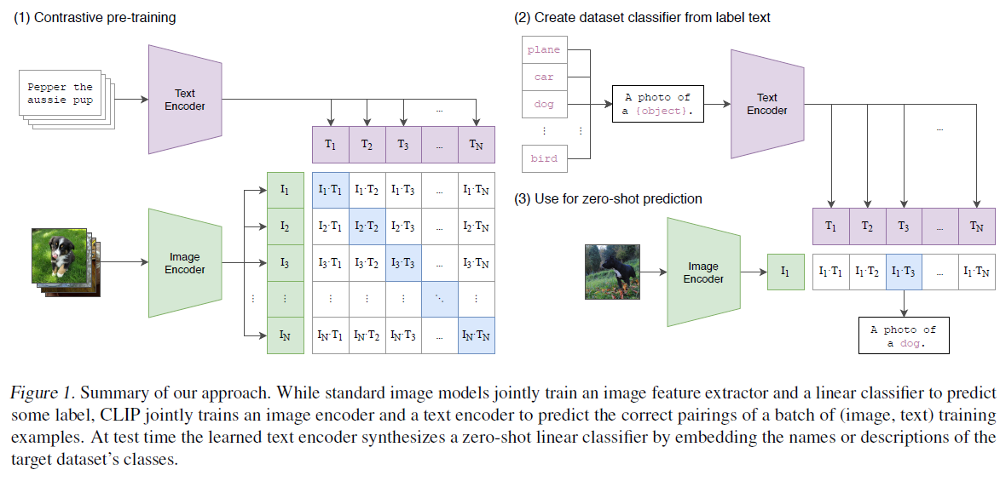

## Learning Transferable Visual Models From Natural Language Supervision

[paper](https://arxiv.org/abs/2103.00020) [Github](https://github.com/OpenAI/CLIP) 



---------------------------------------------------------------------------

<!-- more -->

### 关键点

1. 结合自然文本和图片生成数据集
2. 无需人工标注
3. 对比学习
4. 多模态工作
5. 标签不是提前定义好的列表式的标签

### 综述

1. 之前通过自然语言协助图片分类的工作有着最大的问题就是规模不够大
2. 之前的工作多是用文本带来的弱监督信号去帮助图片的有监督学习，但是这类任务仍然针对的是固定类别的类，没有zero-shot的能力

### 方法

<font color=red size=4>概述</font>

1. 核心是用自然语言的有监督讯号训练视觉任务
2. Transformer和BERT的兴起使得自然语言模型更加强大
3. 数据集有4个亿的图片单词数据对
4. 训练效率对多模态工作的结果非常重要
5. 预测学习（给定图片预测文本）与对比学习相比需要巨大的计算资源

```
# image_encoder - ResNet or Vision Transformer
# text_encoder - CBOW or Text Transformer
# I[n, h, w, c] - minibatch of aligned images
# T[n, l] - minibatch of aligned texts
# W_i[d_i, d_e] - 将图片特征投影到多模态的空间
# W_t[d_t, d_e] - 将文本特征投影到多模态的空间
# t - 学得的温度参数 ???

# 抽取特征
I_f = image_encoder(I) # [n, d_i]
T_f = text_encoder(T) # [n, d_t]

# 使模型能够学习到多模态的特征
I_e = l2_normalize(np.dot(I_f, W_i), axis=1)
T_e = l2_normalize(np.dot(T_f, W_t), axis=1)

# 算下相似度
logits = np.dot(I_e, T_e) * np.exp(t)

# 生成真值并计算损失
labels = np.arange(n) # 因为都是在对角线上配的的
loss_i = cross_entropy_loss(logits, labels, axis=0)
loss_t = cross_entropy_loss(logits, labels, axis=1)
loss = (loss_i + loss_t) / 2
```

6. 在这个工作中，最后用的是线性投射层，而没有使用非线性透射层

<font color=red size=4>训练</font>

1. 调参都是用小模型训练一个周期的结果来调的
2. batch_size = 32768
3. 混精度训练 (???)
4. GPU并行计算

[大模型训练技巧](https://lilianweng.github.io/posts/2021-09-25-train-large/)

5. 训练ViT比训练残差网络效率更高
6. 最后又在更大的图片上微调了一下

### 实验

1. 如何作zero-shot推理?

A: 图片通过编码器得到一个特征，感兴趣的类别输入到"A photo of a {object}"中，然后经过一个文本编码器，得到n个特征，将这n个特征和图片特征点乘后作Softmax，得到在每个类别的概率。
P.S. 为什么不直接用这个类别这一个单词呢？因为训练就是用的句子，存在distribution gap。

2. Prompt (提示) engineering and ensembling ???

- 语言歧义性的问题，比如boxer可以是一种狗也可以是拳击运动员。使用"A photo of a {object}"则使得object一定是名词，因此一定程度上缓解了语言歧义性的问题。
- 另外在宠物的数据集加上一句"a type of pet"作为提示也会得到更好的效果
- 对prompt进行ensemble，即使用很多prompt，最后的结果取他们的平均，则会得到更好的效果。本文用了80个提示模板
  P.S. Linear probe指冻住主干网络，只微调最后一个全连接层的操作

3. 用全部数据和之前的特征学习方法进行对比

- 仍然使用linear probe而不采用fine-tune，因为fine-tune要训练整个网络，这样就不能分辨预训练模型的好坏了；另外也不用调参。
- 模型非常好

### Limitation

1. 和各个数据集的SOTA结果还是有一定差距的，扩大规模不太现实
2. 在有些数据集上表现不太好，无法处理抽象的概念（比如数物体或者判断异常）
3. 在MNIST这类数据集上不太好，和自然图像还是有点差距的，是一个out-of-distribution的数据集
4. 只是从给定类别去做推理，而不能直接写出图片的标签
5. 对数据的利用不是很高效，可以用数据增强、伪标签或自监督减小数据用量
6. 数据没有经过清洗，很可能会带一些社会偏见
7. 很多任务用语言都无法描述的
8. 如何在few-shot也能具有更好的效果

<center><font color=brown size=5> 打破了固定标签类别的范式 </font></center>

