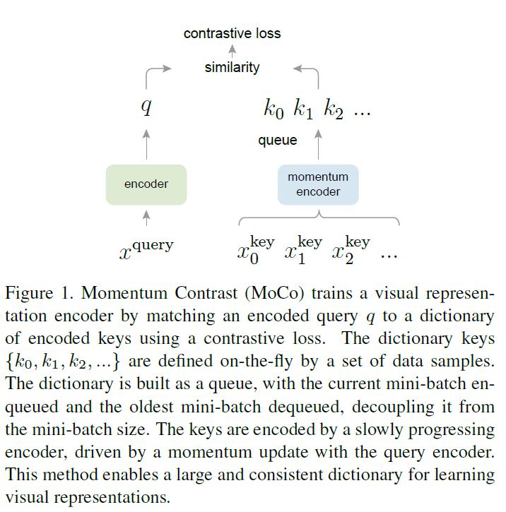

## Momentum Contrast for Unsupervised Visual Representation Learning

[paper](https://openaccess.thecvf.com/content_CVPR_2020/html/He_Momentum_Contrast_for_Unsupervised_Visual_Representation_Learning_CVPR_2020_paper.html) [code](https://github.com/facebookresearch/moco)



---------------------------------------------------------------------------

<!-- more -->

### 什么是对比学习

1. 通过相似度来进行无监督学习
2. 通过代理任务来得到两个图片是否相似，如instance discrimination：将一张图片进行随机裁剪和数据增强得到两个处理后的图片，将这两张图片认为是正样本，其他图片对这两张图片而言是负样本
3. 对比学习在找完正负样本后所做的就是抽取特征，接着使用常见的损失函数如NCE反向传播
4. 关键在于找到定义正样本和负样本的规则(代理任务, pretext tasks)

### 介绍

1. 无监督模型在NLP上的表现很好，如GPT，BERT
2. 对比学习可以被当做动态字典查询问题，即对于目标图片特征(anchor/key)寻找与最相似的图片特征(positive-negative/value)
3. 动态字典越大越好-能够更好地在高维空间进行采样
4. 字典中的keys应该用相同或相似的编码器得到
5. 受限于显存，用队列表示keys，即得到mini-batch样本的特征后，将其放入队列，然后把最早的mini-batch的特征移出队列
6. 使用队列的话字典里的特征就不一致了，因为一部分来自老的，一部分来自新的，采用动量的编码器解决这个问题，即参数一部分来query的编码器，一部分来自前一步的参数，通过调整两者的比例，也就是使参数更多地来自前一步的参数，那么参数将会更新地非常缓慢，从而缓解了队列特征不一致的问题
7. 代理任务选择的是instance discrimination方法
8. 最后MoCo可以在中型数据集ImageNet或者大型数据集Instagram image得到非常好的效果

### 讨论和结论

1. 数据集的增大对于效果的提升没有很多，可能是代理任务的问题
2. 有没有可能把MoCo和NLP里的masked auto-encoding结合起来 (kaiming大神-MAE)

### 方法

1. noise contrasive estimation (NCE)，能够解决softmax类别过多而无法过大的问题。NCE将多分类问题当作一个二分类问题，一共有两类，一类是data sample，另一类是noisy contrastive。
2. InfoNCE
   $$\mathcal{L}_{q}=-\log \frac{\exp \left(q \cdot k_{+} / \tau\right)}{\sum_{i=0}^{K} \exp \left(q \cdot k_{i} / \tau\right)}$$
   where $\tau$ 是一个温度超参数，也就是控制分布的形状，$K$指的是负样本的数量
3. 动量对比
   - 使用队列能够使字典大小和batch size分离开，从而使用标准的batch size。
   - 使用队列能够使字典使用之前编码好的key，而不用重新进行计算
   - 字典是整个数据集的一个子集，对应了前面提到的NCE中的estimation，即只选用一部分样本作为负例，从而减小计算开销
   - 使用队列可以移走最老的特征，从而保持了字典的一致性，即几乎都是用一个编码器编的
   - 因为这个队列非常大，因此很难去通过反向传播去更新所有key的编码器
   - 能不能直接吧query的编码器直接给key用呢？结果并不好，可能是因为编码器太快改变了，因此使得队列中元素的一致性遭到破坏。由此引出动量更新：$\theta_{\mathrm{k}} \leftarrow m \theta_{\mathrm{k}}+(1-m) \theta_{\mathrm{q}}$
   - 用一个非常大的动量(0.999)就可以使得参数更新得很慢
   - 端到端的对比学习，也就是key和query的编码器使用同一个，并使用梯度回传更新参数。优点是字典的一致性非常高，缺点就是字典的大小需要和mini-batch的size一样，从而限制了字典的大小
   - memory bank。对于query使用编码器，对于key建立一个memory bank，这个bank是将所有的key储存起来，接着在训练的时候抽样一些算出来contrastive loss后更新query的编码器，接着用这个编码器将抽样后的样本重新计算特征，将计算完的特征再扔回memory bank里。这样会使得key的特征的一致性非常差。同时不太容易处理数据集非常大的任务

P.S. trivial solution - 捷径解 (TSTiNet)

4. 伪代码

```
# f_q, f_k: encoder networks for query and key
# queue: dictionary as a queue of K keys (CxK)
# m: momentum
# t: temperature

f_k.param = f_q.params # initialize
for x in loader: # load a minibatch x with N samples
	x_q = aug(x) # a randomly augmented version
	x_k = aug(x) # another randomly augmented version

	q = f_q.forward(x_q)  # queries: NxC
	k = f_k.forward(x_k)  # keys: NxC
	k = k.detach() # k进行梯度回传操作

	# positive logits: Nx1
	l_pos = bmm(q.view(N, 1, C), k.view(N, C, 1))

	# negative logits: NxK
	l_neg = mm(q.view(N, C), queue.view(C, K))

	# logits: Nx(1+K)
	logits = cat([l_pos, l_neg], dim=1)

	# contrastive loss
	labels = zeros(N) # positives are the 0-th
	loss = CrossEntropyLoss(logits/t, labels)

	# query网络的更新
	loss.backward()
	update(f_q.params)

	# momentum update: key network
	f_k.params = m*f_k.params + (1-m)*f_q.params

	# 更新字典
	enqueue(queue, k) # 让minibatch进入队列
	dequeue(queue) # 让minibatch走出队列
```

5. Shuffle BN: 为了防止模型学到捷径，因为BN会算当前样本的running mean和running variance，从而泄露信息，那么模型就会根据这些泄露的信息很容易找到那个正样本。因此Shuffle BN采用先把样本的顺序打乱，送到各个GPU上，最后再恢复顺序

### 实验与结果

1. 在ImageNet-1k和Instegram-1B进行训练
2. 学习率设为了30，可能有监督对比学习和无监督对比学习学到的特征非常不一致
3. MoCo的扩展性好，硬件要求低
4. 无监督学习最主要的目标最重要的就是生成可泛化的特征
5. 用了特征归一化，然后用有监督训练的超参数做微调
